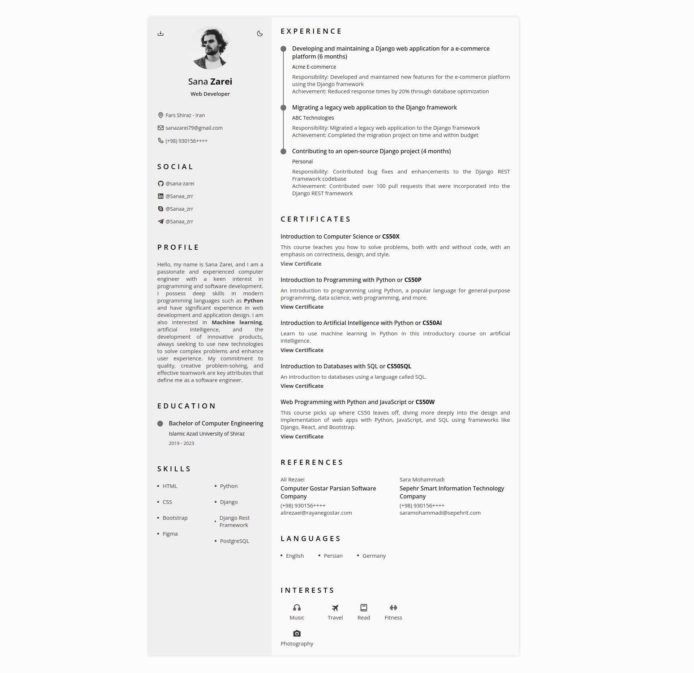
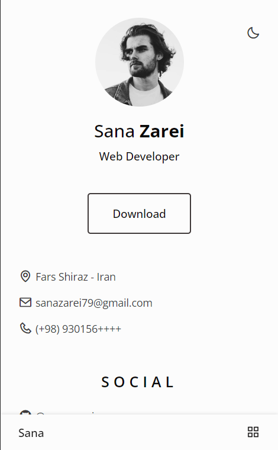

# Responsive Resume Sana Zarei
### Responsive Resume Sana Zarei

- Responsive Resume Cv Website Using HTML CSS And JavaScript
- Contains a mobile navigation with icons.
- Smooth scrolling in each section in mobile version.
- Includes a light and dark theme.
- Export resume website to PDF.

**To-Do List:**
    - [ ] Publish Initial Version of the Website
    - [ ] Fix PDF Export Issue
    - [ ] Optimize for SEO
    - [ ] Optimize Performance
    - [ ] Regularly Update Content

  <strong>Desktop Mode + Light Theme</strong>

  

  <strong>Phone Mode + Light Theme</strong>

  

